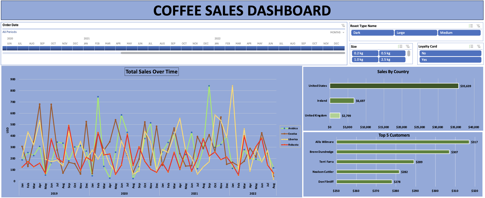

# Coffee Sales Business Dashboard
Business intelligence dashboard developed in Excel showcasing KPI tracking, data modeling, and interactive sales performance analysis.
# 📌 Project Overview
This project presents an interactive business intelligence dashboard built in Microsoft Excel to analyze coffee sales performance across time, geography, products, and customer segments. The goal of the project was to transform raw transactional data into a structured analytical model and develop a dynamic dashboard that supports data-driven decision-making.
The dashboard enables stakeholders to explore key performance indicators (KPIs) through interactive filters, timelines, and visual analytics.
# 🎯 Business Objective
1: Analyze monthly sales trends

2: Identify top-performing products and customers

3: Compare country-level sales performance

4: Enable interactive KPI exploration for business insights

# 🛠 Data Preparation & Modeling
### The project involved structured data transformation and modeling:

1: Converted raw data into structured Excel Tables

2: Used XLOOKUP to merge customer attributes into transactional data

3: Implemented INDEX + MATCH for dynamic product lookups

4: Created calculated fields:

        a) Total Sales (Unit Price × Quantity)
        
        b) Coffee Type Name (expanded categories)
        
        c) Roast Type Name (expanded categories)
        
5: Applied currency and date standardization

6:  Ensured data integrity through duplicate validation
        
# 📊 Dashboard Components

### 1️⃣ Total Sales Over Time

       a) Monthly sales trend analysis

       b) Segmented by coffee type

       c) Enables time-series performance comparison

### 2️⃣ Sales by Country

1: Performance comparison across:

      a) United States
   
      b) Ireland

      c) United Kingdom
   
2: Sorted for ranking analysis

### 3️⃣ Top 5 Customers

      a) Dynamic Top-N filtering

      b) Identifies high-value customers

      c) Automatically updates based on filters

# 🎛 Interactive Features

1: The dashboard includes:

    a) Timeline filter (Order Date)

2: Slicers for:

    a) Roast Type
   
    b) Package Size
    
    c) Loyalty Card Status
   
   
3: Report Connections to synchronize all visuals

# 📈 Key Skills Demonstrated

1: Business Intelligence Reporting

2: KPI Development & Tracking

3: Data Modeling in Excel

4: Advanced Lookup Functions (XLOOKUP, INDEX/MATCH)

5: PivotTables & PivotCharts

6: Top-N Analysis

7: Interactive Dashboard Design

8: Analytical Thinking & Business Insight Generation

## 📷 Dashboard Preview

